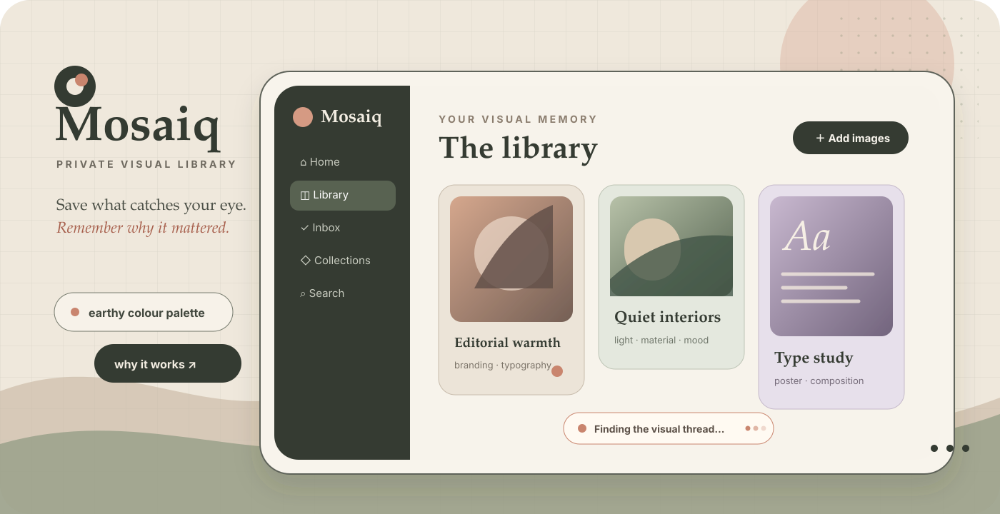

<div align="center">
  
</div>

<div align="center">
  <br />
  <a href="https://github.com/vixotic/mosaiq/actions/workflows/ci.yml">
    
  </a>
  
  
  
</div>

<p align="center">
  <strong>A quiet, image-first home for the visual references I want to remember.</strong>
  <br />
  Save an image, understand what makes it interesting, and find it again when it matters.
</p>

## Why I made this

I save visual references everywhere: interface details, type treatments, interiors, packaging,
photography, furniture, layouts, and things that do not fit neatly into any one category. Folders
remember where a file was placed, but not why it was worth saving.

Mosaiq is my attempt at a more thoughtful personal library. It keeps the original images under my
control, adds useful visual context with AI when I want it, and lets my own notes and decisions
remain the source of truth.

It is intentionally a **single-owner hobby project**—private behind one login, with no teams,
subscriptions, social features, or content feed.

## What it feels like

- **Drop in a handful of references.** Mosaiq validates them, avoids exact duplicates, and creates
  lightweight thumbnails.
- **Browse before processing finishes.** Imports appear immediately while analysis continues in
  the background.
- **Remember why something mattered.** “Why this matters” captures the useful idea, not merely the
  objects visible in the image.
- **Organize without moving files.** Tags and collections are virtual; one reference can belong in
  several contexts.
- **Browse AI-made smart categories.** Analyzed references gather automatically by subject, style,
  mood, and possible use case while manual collections remain fully yours.
- **Search in visual language.** Find references through titles, notes, styles, colours, moods,
  objects, layout patterns, and inspiration reasons.
- **Keep personal judgment in charge.** Handwritten titles, descriptions, notes, and tags are
  never replaced by a later AI analysis.

## A small tour

| Library                                                     | Visual understanding                                                     | Personal context                                                 |
| ----------------------------------------------------------- | ------------------------------------------------------------------------ | ---------------------------------------------------------------- |
| A responsive, image-first gallery with sorting and filters. | Structured descriptions, styles, colours, moods, subjects, and patterns. | Notes, favourites, ratings, tags, review state, and collections. |
| Imports are available immediately.                          | Gemini, Ollama, or a built-in mock analyzer.                             | User-written metadata always wins.                               |

Other useful touches include batch import, SHA-256 duplicate detection, retryable background
analysis, immutable analysis history, soft deletion, and local thumbnail generation.

## Run it locally

You will need:

- Node.js 22 or newer
- pnpm 9
- PostgreSQL 16+, or Docker Desktop

```bash
git clone https://github.com/vixotic/mosaiq.git
cd mosaiq
corepack enable
pnpm install
cp .env.example .env
pnpm auth:hash-password
```

Copy the generated Argon2id value into `AUTH_OWNER_PASSWORD_HASH` in `.env`, enclosed in single
quotes so its `$` characters remain literal, and choose the owner name with
`AUTH_OWNER_USERNAME`. The password itself is never stored. Then finish setup:

```bash
docker compose up -d postgres
pnpm db:migrate
pnpm dev
```

Open [http://127.0.0.1:5173](http://127.0.0.1:5173) and sign in.

Mosaiq still works as a manual visual library when no AI service is configured. Set
`AI_PROVIDER=mock` in `.env` for an entirely self-contained tour.

## Add visual analysis

### Gemini

Create a key in [Google AI Studio](https://aistudio.google.com/app/apikey), then set:

```env
AI_PROVIDER=gemini
GEMINI_API_KEY=your-api-key
GEMINI_MODEL=gemini-flash-latest
```

The key stays in the backend environment and is never sent to the browser. Images analyzed with
Gemini are sent to Google, so I use Ollama instead for references that must remain entirely on my
machine.

### Ollama

Install [Ollama](https://ollama.com), start it, and pull a vision-capable model:

```bash
ollama serve
ollama pull llava:7b
```

Then set:

```env
AI_PROVIDER=ollama
OLLAMA_BASE_URL=http://127.0.0.1:11434
OLLAMA_MODEL=llava:7b
```

Different local models vary in metadata quality and JSON reliability. Mosaiq normalizes partial
results and keeps the last successful analysis when a reanalysis fails.

## Your images stay yours

Originals and thumbnails live beneath `STORAGE_ROOT` (the default is `./storage`). PostgreSQL stores
searchable metadata, relationships, processing state, and analysis history; it does not store the
large image binaries.

For an always-on installation, Mosaiq can instead use a private OCI Object Storage bucket while
keeping all bucket credentials on the backend. See [OCI Object Storage](./docs/oci-object-storage.md)
for the bucket, instance-principal, and migration setup.

For a complete backup, keep these two pieces together:

1. A PostgreSQL backup.
2. A copy of the active image store: the matching `storage/` directory or OCI bucket.

The library, image files, metadata, settings, and processing actions all require the configured
owner session. Sign-in attempts are rate-limited, sessions can be revoked by signing out, and the
browser cookie is inaccessible to frontend code. For an internet-facing installation, use HTTPS
and a carefully configured reverse proxy; the production cookie is sent only over secure
connections. See [Private owner access](./docs/authentication.md) for local and hosted settings.

## Useful commands

```bash
pnpm dev          # start the API and web app
pnpm db:migrate   # apply database migrations
pnpm auth:hash-password
pnpm typecheck
pnpm lint
pnpm test
pnpm build
```

<details>
<summary><strong>Formats and practical limits</strong></summary>

<br />

Mosaiq accepts JPEG, PNG, and static WebP images. SVG, GIF, animated WebP, HEIC, PDF, video, and
multi-page formats are rejected. Files are limited to 25 MiB by default, with a separate
decoded-pixel safety limit.

Configuration lives in `.env`; the available variables are documented in
[`.env.example`](./.env.example).

</details>

<details>
<summary><strong>How it is put together</strong></summary>

<br />

The web app is React, TypeScript, Vite, and TanStack Query. The API is NestJS. PostgreSQL and
Drizzle hold the library metadata, and a small persistent database queue runs image analysis
without requiring Redis. Provider adapters keep Gemini, Ollama, and the mock analyzer
interchangeable.

More detail is available in [How Mosaiq works](./docs/how-mosaiq-works.md).

</details>

## A personal work in progress

Mosaiq is being shaped around my own reference-gathering habits. It may change as those habits
change. If it is useful to you too, feel free to explore the code, adapt the ideas, or open a
thoughtful issue.
